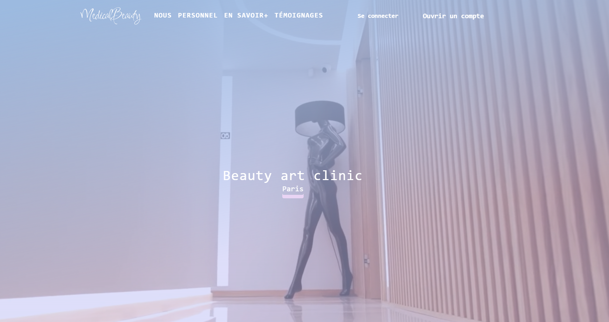

# Built with NextJS and Tailwind

## Overview ##





## How To Use

To clone and run this application, you'll need Git and Node.js (which comes with npm) installed on your computer. From your command line:
```
# Clone this repository
$ git clone https://github.com/munozmaria/medicalPro.git

# Install dependencies both in back and front folders
$ npm install

# Run the app in front folder:
$ npm run dev

```

Open [http://localhost:3000](http://localhost:3000) with your browser to see the result.


